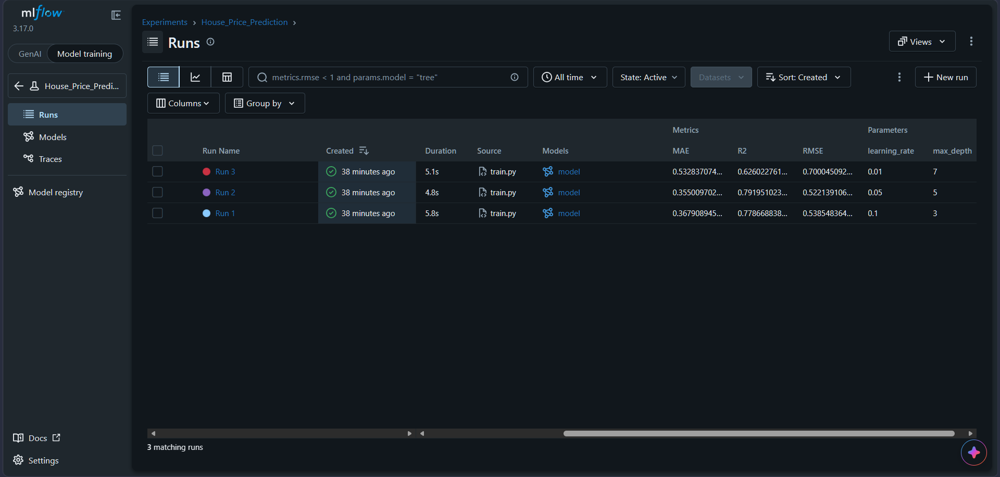

# MLflow Machine Learning Experiment Tracking

## Overview
This repository demonstrates end-to-end Machine Learning Experiment Tracking using **MLflow** and **XGBoost**. The project evaluates multiple gradient boosting regression models trained on the **California Housing Dataset** to predict house prices, logs hyperparameters and evaluation metrics, and identifies the optimal model configuration.

---

## Project Architecture & Directory Structure
```text
mlflow/
├── train.py           # Model training and MLflow tracking script
├── requirements.txt   # Python dependencies
├── README.md          # Project documentation
├── screenshot.png     # MLflow UI run comparison screenshot
└── .gitignore         # File exclusion config


```
---

## Getting Started

### 1. Clone the Repository

```powershell
git clone https://github.com/salmahamdy246/MLFlow.git
cd mlflow

```

### 2. Install Dependencies

```powershell
pip install -r requirements.txt

```

### 3. Train Models & Log Experiments

```powershell
py train.py

```

### 4. Launch MLflow UI

```powershell
py -m mlflow ui

```

Open [http://127.0.0.1:5000] in web browser.

---

## MLflow UI Results



### Model Comparison Table

| Run Name | Max Depth (`max_depth`) | Learning Rate (`learning_rate`) | RMSE | MAE | R² Score |
| --- | --- | --- | --- | --- | --- |
| **Run 1** | 3 | 0.10 | 0.5385 | 0.3679 | 0.7787 |
| **Run 2** (Best) | **5** | **0.05** | **0.5221** | **0.3550** | **0.7920** |
| **Run 3** | 7 | 0.01 | 0.7000 | 0.5328 | 0.6260 |

---

## Selected Best Model

* **Best Model:** **Run 2**
* **Optimal Hyperparameters:** `max_depth = 5`, `learning_rate = 0.05`

### Justification 

1. **Lowest Predictive Error:** **Run 2** achieved the lowest Root Mean Squared Error (**RMSE: 0.5221**) and lowest Mean Absolute Error (**MAE: 0.3550**).
2. **Highest Goodness of Fit:** Reached the highest coefficient of determination (**R²: 0.7920**), accounting for **79.2%** of the variance in housing prices.
3. **Optimal Model Complexity:** A tree depth of `5` combined with a moderate learning rate of `0.05` offered the ideal balance, effectively capturing non-linear feature relationships without underfitting or overfitting.

```

